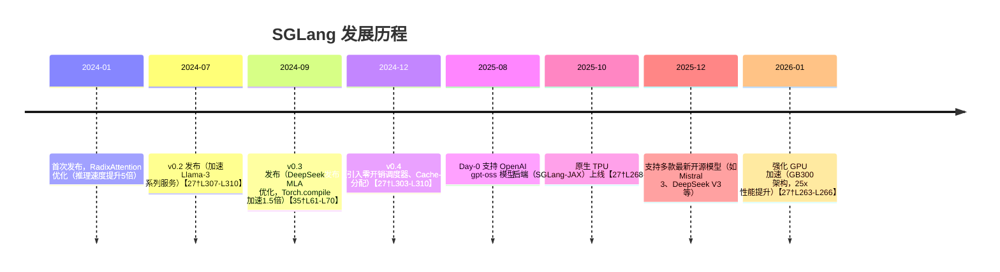
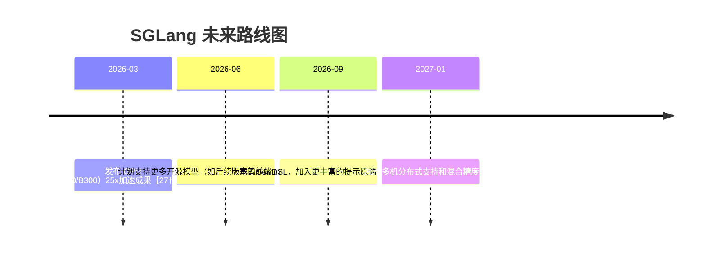

# 执行摘要

SGLang 是由 LMSYS 组织开发的开源高性能大语言模型（LLM）推理框架和**结构化生成语言**（embedded DSL）。它通过前后端协同设计，以 Python 为前端编程接口，提供多代调用、并行推理、KV 缓存重用等优化，大幅提升推理吞吐和降低延迟【20†L86-L93】【59†L41-L48】。SGLang 支持复杂的对话、多轮询问、树形思维 (Tree-of-Thought)、ReAct 智能体、RAG 等场景【20†L68-L77】【59†L41-L48】。其后端运行时采用 RadixAttention 前缀缓存、零开销调度器、连续批处理和多模型分布式并行等技术，实现了在不同硬件（NVIDIA/AMD GPU、TPU 等）上高效运行。官方文档称 SGLang 是“快速的语言模型推理引擎”，并已在业界广泛采用【59†L39-L46】【31†L142-L144】。本文将从官方资源、语言设计、语法特性、生态系统、性能基准、社区与应用、安全性以及学习资源等方面深入分析 SGLang，帮助读者全面了解其技术细节与应用前景。

## 官方来源

- **官方网站与文档**：SGLang 官方文档地址为 [docs.sglang.io](https://docs.sglang.io/)【31†L121-L124】。同时有中文社区维护的中文文档站点（如 sglang.org、LlamaFactory.cn 上的翻译版）【59†L39-L46】。官方仓库位于 GitHub 上的 `sgl-project/sglang`（已有 2.53 万星），并托管在非营利组织 **LMSYS** 旗下【30†L369-L372】。官方交流渠道包括 [Slack 社区](https://slack.sglang.io)、每周开发者会议等【27†L257-L259】。
- **许可证**：SGLang 采用 **Apache 2.0** 开源许可证【28†L969-L976】。许可证声明显示“Copyright 2023-2024 SGLang Team”【28†L967-L976】。
- **维护者**：PyPI 页面显示主要维护者为 `lmzheng` 和 `ying1123`【37†L48-L51】，均为 LMSYS 团队成员。项目发布于 PyPI 的最新版本为 0.5.9（2026年2月发布）【37†L27-L35】。
- **发布说明**：官方博客和文档记录了重要版本更新。例如：
  - 2024年1月：首次发布 RadixAttention 优化，可实现 **5 倍** 加速【27†L312-L314】。
  - 2024年7月：发布 v0.2，主要提升 Llama-3 系列模型性能【27†L307-L310】。
  - 2024年9月：发布 v0.3，引入 DeepSeek MLA 优化、Torch.compile 集成等【35†L61-L70】。
  - 2024年12月：发布 v0.4，引入零开销批调度器、Cache-Aware 负载均衡等【27†L303-L310】。
  - 2025年10月：新增原生 TPU（SGLang-JAX）支持【27†L268-L271】。
  - 2025年12月：Day-0 支持多款开源新模型（如 MiMo-V2-Flash、Nemotron、MiniMax M2 等）【27†L267-L270】。
  - 2026年1月：GPU 硬件优化，在 NVIDIA GB300 等新架构上实现高达 25 倍加速【27†L263-L266】。  

上述里程碑构成了 SGLang 的发展脉络，后文用流程图形式概览：  



## 语言设计

- **设计目标**：SGLang 致力于针对复杂的 LLM 推理工作负载进行优化。传统推理框架往往将每个提示视为独立请求，无法重用上下文；而 SGLang 认为「将 LLM 工作视为程序而非孤立提示」【20†L81-L89】。因此其前端允许将多轮对话、控制流、并行分支等结构化地组合成一个程序，后端则利用这些结构信息提高缓存命中率和并行度【20†L81-L90】【43†L80-L89】。
- **编程范式**：SGLang 是**嵌入式 DSL**，以内置 Python 为前端语言【20†L86-L93】。开发者只需在 Python 中导入 `sglang` 并使用 `@sgl.function` 装饰器即可定义 SGLang 函数【16†L148-L156】。SGLang 原语（如 `gen`、`select`、`fork` 等）与原生 Python 控制流自然融合【20†L106-L114】，无需进行字符串拼接式的提示操作。此设计使得程序既保留了 Python 的灵活性，也直接暴露了生成结构（如并行分支、停止词等）供后端优化使用【20†L106-L114】。
- **类型系统**：前端基于 Python 运行，采用动态类型系统。函数参数和返回值类型与 Python 一致，无静态类型检查。生成的变量通常为字符串（Token 序列），也支持图像等多模态数据【40†L247-L254】。
- **内存模型**：SGLang 引擎在后端管理 KV 缓存。其核心创新 RadixAttention 使用**基数树（Radix Tree）**来存储和复用前缀的 KV 缓存【20†L129-L137】【43†L80-L89】。共享前缀对应相同节点，避免重复计算，并采用 LRU 策略回收过期缓存。NVIDIA 文档指出，RadixAttention 极大提升了带缓存场景下的吞吐和延迟性能【43†L80-L89】。
- **并发模型**：SGLang 支持异步并发执行。在前端，当遇到并行分支 (`s.fork(n)`) 时，运行时会异步发起多个生成调用（GPU 内核），各分支并行执行，最终通过 `join()` 合并结果【18†L310-L319】【20†L111-L119】。从开发者角度看，这种异步执行类似于启动并行 GPU kernel，只有在取结果时才进行同步【20†L111-L119】。此外，SGLang 可进行流式输出（streaming）和批量并行（batch）请求，利用零开销调度器实现多租户高利用率【43†L89-L96】【45†L91-L100】。
- **编译与运行时**：SGLang 前端无需显式编译，程序即为 Python 代码，使用 Python 解释执行。后端运行时由 Python 实现核心调度逻辑和 CUDA/PyTorch 内核。为提升性能，SGLang 集成了 PyTorch 2.0 的 `torch.compile` 功能，对 Transformer 的线性/归一化层进行 Fusion 优化【35†L63-L72】。官方示例中只需启动服务时加 `--enable-torch-compile` 参数，即可获得显著加速（对小批量推理加速高达 1.5 倍【35†L63-L72】）。
- **工具链**：SGLang 主要通过 Python 打包分发，依赖 Python ≥3.10【37†L63-L66】。安装后可以使用 `sglang launch_server` 等命令启动推理服务（例如 `python3 -m sglang.launch_server --model-path <model>`）【35†L109-L118】。此外，SGLang 提供 `sglang.bench_serving` 基准工具、Docker 镜像【55†L58-L66】等。调试方面，可使用常规 Python 调试器（pdb、IDE 调试）与日志，同时后端提供丰富的监控指标和跟踪接口。
- **互操作性**：SGLang 前端程序是 Python，因此天然可与 Python 生态互操作。后端可调用 Hugging Face、OpenAI、Anthropic 等多种模型（支持绝大多数 HF 模型）【59†L47-L48】【27†L329-L334】。SGLang 也提供类 HTTP 的原生 API 与 OpenAI 兼容的接口，使得其他语言或平台可通过网络访问 SGLang 服务（例如 Rancher 服务或内部 RPC）。此外，SGLang 与常见模型微调框架（如 LoRA）等兼容，易于集成现有 AI 基础设施。

## 语法与核心特性

SGLang 通过标记 Python 函数来定义生成程序，以 `@sgl.function` 装饰：

```python
import sglang as sgl

@sgl.function
def text_qa(s, question):
    # 将用户问题添加到上下文
    s += "Q: " + question + "\n"
    # 生成回答，存储在变量 "answer"
    s += "A: " + sgl.gen("answer", stop="\n")
```
如上所示，`@sgl.function` 将普通 Python 函数转换为 SGLang 生成程序。第一个参数 `s` 是 *状态对象*，用于管理对话上下文，其他参数为输入变量【16†L148-L156】。在函数体内可通过 `s += <文本>` 追加提示文本，通过 `sgl.gen("var", ...)` 向模型请求生成并将结果保存到状态。生成结果可通过 `s["var"]` 或 `state.get_var("var")` 访问【18†L331-L334】【40†L249-L254】。

主要语法特性包括：  
- **变量与访问**：生成的文本自动存入命名变量。示例：  
  ```python
  @sgl.function
  def ask_number(s):
      s += "Please say a number: " + sgl.gen("num", max_tokens=5)
      s += f"\nYou said: {s['num']}"
  ```
  这里 `s['num']` 可取得模型生成的数字【40†L249-L254】。
- **角色管理**：针对对话模型，可使用角色片段构造提示，如 `s += sgl.system("系统提示")`、`s += sgl.user("用户说话")`、`s += sgl.assistant("助手回应")`【16†L211-L220】。也可使用上下文管理器简化结构。
- **组合与复用**：SGLang 函数可嵌套调用。例如：
  ```python
  @sgl.function
  def inner(s, topic):
      s += f"Tell me about {topic}: " + sgl.gen("info", max_tokens=50)
  
  @sgl.function
  def outer(s, topic1, topic2):
      s += inner(topic=topic1)
      s += inner(topic=topic2)
  ```
  如此可将子任务封装为函数，实现模块化【40†L260-L268】。
- **并行分支**：使用 `s.fork(n)` 将当前状态 fork 成 $n$ 个分支，同时并行进行生成。示例（对同一问题生成 5 个不同回答）：
  ```python
  @sgl.function
  def multi_answer(s, question, n):
      s += "Question: " + question + "\n"
      forks = s.fork(n)
      forks += "Answer: " + sgl.gen("ans", stop="\n")
      forks.join()
  ```
  随后可通过 `state["ans"][i]` 获取每个分支生成的答案【18†L310-L319】【18†L331-L334】。
- **流式与异步**：支持生成流式返回。在 Python 中可用异步迭代读取流数据，例如：  
  ```python
  import asyncio
  async def async_stream():
      state = multi_turn_question.run(..., stream=True)
      async for out in state.text_async_iter(var_name="answer"):
          print(out, end="", flush=True)
  asyncio.run(async_stream())
  ```
  这里 `state.text_async_iter()` 是异步迭代器，可并发处理结果【40†L217-L226】。
- **错误处理**：生成过程中发生异常时，可通过 `state.error()` 获取错误信息，并结合 Python 的 `try/except` 进行处理。此外，如果模型生成的文本不符合约束，可以利用正则或 FSM 进行后置验证（下述约束功能）。
- **约束生成**：SGLang 支持在生成调用中指定约束选项，如限定输出必须从给定选项中选择（`choices=["opt1", "opt2"]`）、满足正则表达式（`regex=...`）或结构化 JSON（通过 pydantic 模型生成约束表达式）【40†L272-L282】。例如使用 `regex` 强制生成合法 IP 地址、或使用 JSON Schema 生成固定结构的数据。
- **其他特性**：当前不支持静态泛型或宏系统；元编程主要依赖 Python 自身功能（如装饰器）。状态对象 `state` 提供丰富方法，如 `state.text()` 获取完整输出文本，`state.messages()` 获取对话消息列表，`state.sync()` 等待异步调用完成等【18†L399-L408】。

## 标准库与生态系统

- **标准库**：SGLang 本身基于 Python，无独立“标准库”。其功能主要通过 Python 和专用模块 `sglang` 提供。开发者可以使用 Python 全部标准库功能，并结合 SGLang 状态对象构造输入输出。
- **主要依赖库**：后端主要依赖于 PyTorch 及其优化内核（FlashInfer、CUTLASS 等），以及 Hugging Face Transformers、Diffusers、ModelScope 等模型库。为支持多模态，还集成图像处理库。官方还提供了 **SGLang-Diffusion** 模块，用于加速图像/视频扩散模型推理【44†L17-L24】【27†L265-L269】。
- **包管理与分发**：SGLang 发布在 PyPI（包名 `sglang`）【37†L27-L35】。可通过 `pip install sglang` 直接安装。PyPI 显示最新 0.5.9 版（2026/02 发布），并提供额外依赖选项（如 `sglang[diffusion]`）【37†L63-L66】。常见安装配置命令示例如：`pip install "sglang[all]>=0.5.0"`。
- **构建/测试**：官方仓库使用 GitHub Actions 进行 CI/CD，包含构建、单元测试、基准测试等流程（参见仓库的 `.github/workflows`）。发布版本时会同步更新 PyPI 包和 Docker 镜像。
- **容器与平台**：官方提供 NVIDIA NGC 或 Docker Hub 镜像（如 `lmsysorg/sglang:latest`）【55†L58-L66】，方便部署。社区也有用户镜像和华为云环境部署指南等资源【55†L25-L33】【55†L58-L66】。
- **IDE/编辑器支持**：SGLang 代码即 Python 代码，因此支持所有主流 Python IDE/编辑器（如 VS Code、PyCharm、Jupyter、Emacs 等）的语法高亮、调试和自动补全功能。目前暂无专门针对 SGLang 的插件，开发时常用 Python 开发套件即可。
- **生态系统**：SGLang 与开源模型和框架高度兼容（可对接几乎所有 Hugging Face 模型和 OpenAI API【27†L329-L334】）。社区已出现多种工具集成，如与加速库（FlashInfer、ONNX）、量化工具（GPTQ、AWQ）集成、在数据中心云平台的部署示例（AWS、Azure、GCP 等提供支持【30†L362-L370】）。SGLang 也与强化学习平台和后训练项目协作（例如被用于多模型训练的 Rollout 引擎【27†L338-L343】）。总之，SGLang 依托 Python 生态，具有灵活的扩展性，可嵌入现有应用。

## 性能特点与基准

SGLang 在性能上专注于多层面优化：RadixAttention 前缀缓存复用、零开销批调度、连续批处理、分布式并行等【43†L80-L89】【27†L325-L334】。官方提供的基准测试显示，SGLang 在多种模型和硬件上表现卓越。以 Llama-70B 为例，SGLang 在 8×A100 GPU 上的吞吐量 **比 vLLM 高 3.1 倍**【45†L46-L52】；在 Llama-8B 情况下，SGLang 与 NVIDIA TensorRT-LLM 在离线推理中均可达到 ~5000 tokens/s，而 vLLM 明显落后【45†L91-L99】。对于 DeepSeek 的多头潜注意力（MLA）模型，SGLang v0.3 版本的吞吐是基线系统的 3–7 倍【35†L43-L50】。与此同时，SGLang 在低延迟场景也有优化，例如通过连续批处理和 CPU/GPU 重叠调度，保持高 GPU 利用率【45†L91-L99】【20†L111-L119】。下表对比了 SGLang 与其他主流推理框架的一些特点与基准：  

| 特性/框架    |                          **SGLang**                          |                  **vLLM**                  |                       **TensorRT-LLM**                       |
| ------------ | :----------------------------------------------------------: | :----------------------------------------: | :----------------------------------------------------------: |
| **编程语言** |              Python（嵌入式 DSL）【20†L86-L93】              |               Rust + Python                |                           C++/CUDA                           |
| **缓存机制** |               Radix 树前缀缓存【20†L129-L137】               |             无（或按手动策略）             |                         固定前缀缓存                         |
| **调度方式** |          异步重叠执行，零开销批调度【20†L111-L119】          |                 批处理调度                 |                          批处理调度                          |
| **性能表现** | Llama-70B：吞吐比 vLLM 高 3.1 倍【45†L46-L52】<br>Llama-8B：可达 ~5000 tok/s【45†L91-L99】 | Llama-70B 基准（标称 1x）；通常低于 SGLang | Llama-8B 可达 ~5000 tok/s【45†L91-L99】；长上下文优于 SGLang |
| **许可证**   |                  Apache 2.0【28†L969-L976】                  |                 Apache 2.0                 |                          Apache 2.0                          |

**典型应用领域**：SGLang 适用于需要**多轮对话管理、提示链式调用、智能体或 RAG 流程**的场景【20†L68-L77】【55†L25-L31】。官方文档和博客指出，其应用包括智能客服、内容创作辅助、代码生成辅助等【55†L25-L31】。实际案例上，LMSYS 的 Chatbot Arena（对话系统平台）和 Databricks 等公司已使用 SGLang 支撑大规模在线推理，每天产生的 token 数以万亿计【45†L53-L58】。社区报告还显示 SGLang 已在全球范围内超过 40 万块 GPU 上部署【31†L142-L144】。  

## 采用与社区

SGLang 拥有活跃的开源社区和广泛的产业支持。【30†L362-L370】列举了包括 xAI（Meta）、AMD、NVIDIA、Intel、LinkedIn、谷歌云、微软 Azure、AWS、阿里云、腾讯云等多家机构的采用案例。此外，多所高校（MIT、UCLA、清华等）和 AI 初创团队也在使用 SGLang【30†L362-L370】。LMSYS 组织下的 Slack 社区和 GitHub Discussions 上聚集了开发者，官方定期举办线上会议分享进展【27†L257-L259】【30†L369-L372】。SGLang 曾获得 a16z 开源 AI 基金资助，表明业界对其基础设施价值的认可【27†L287-L290】。知名项目如 Guidance、LMQL 等也与 SGLang 互有借鉴【30†L387-L390】。总体来看，SGLang 已成为业界事实标准级的 LLM 推理引擎，在产业界处于领先地位。

## 安全考虑与常见陷阱

- **输入安全**：与所有 LLM 系统类似，SGLang 使用的提示文本可能遭受提示注入攻击（prompt injection）等风险，需确保不执行来自不可信输入的指令。建议对外部输入进行验证，对外部接口加固，如使用严格的正则/JSON 验证规则【40†L274-L283】。
- **反序列化漏洞**：近期出现过针对 SGLang 的高危安全事件。据安全报告，SGLang 曾在 `/update_weights_from_tensor` 接口中使用 `pickle` 反序列化动态权重更新数据，未做校验，导致远程代码执行漏洞（CVE-2025-10164）【52†L30-L39】。该漏洞影响范围广泛，一旦部署未打补丁的 SGLang 服务器可能被攻击者接管【52†L30-L39】。官方已修复该问题，**务必使用最新版本** 或禁用相关接口以避免风险【52†L30-L39】。
- **性能与资源陷阱**：SGLang 的状态对象会累积对话历史和生成内容，当上下文很长时会占用较多内存。编写程序时应注意适当清理或限制历史长度。并行执行时也要防止创建过多分支导致显存耗尽。使用浮点量化、分布式并行等技术可缓解大模型推理的资源压力【27†L325-L334】【35†L61-L70】。
- **调试与稳定性**：SGLang 程序调试主要依赖 Python 工具，但由于涉及异步分支和外部 API 调用，调试复杂性较普通脚本高。建议在开发环境中使用小批量、短上下文进行测试。遇到生成不稳定问题时，可通过指定 `stop`、正则等明确约束，或使用 State.error() 获取错误原因【18†L399-L408】。
- **迁移路径**：对于从其他语言或框架迁移的工程，需要重构提示逻辑。迁移到 SGLang 的过程通常涉及将业务逻辑封装为多个 `@sgl.function` 函数，并利用状态对象维护对话上下文。得益于 Python 兼容性，已用 Python 实现的应用迁移成本较低；对于其他语言，可通过调用 SGLang 服务接口（OpenAI 兼容 API）逐步引入。初学者应注意 SGLang 的生成式编程范式与传统命令式不同，需要适应先构造好前缀再生成的思路。

## 学习资源

- **官方教程和文档**：入门可参考 SGLang 官方文档（英文）[docs.sglang.io](https://docs.sglang.io/)【31†L121-L124】以及中文社区翻译（如 LlamaFactory 的 SGLang 文档）【59†L39-L47】。文档包含快速开始指南、API 参考和示例代码。
- **技术博客**：LMSYS 团队在官网博客发布了多篇详细介绍（如 v0.2、v0.3 发布说明）【45†L46-L54】【35†L61-L70】；还有社区技术博客（如 SugiV 的深度解析【33†L32-L40】）可供深入学习架构和优化原理。
- **视频与演讲**：SGLang 团队在 PyTorch 和社区会议上有演讲（如 2025 年 PyTorch 会议上的 SGLang 介绍）。GitHub 上的[幻灯片](https://github.com/sgl-project/sglang/blob/main/Docs/slides)和活动回放可参考。
- **社区论坛**：SGLang 在 GitHub 上有活跃讨论区 (Discussions)；官方 Slack [sglang.io] 频道可即时交流问题。知乎、CSDN 等中文社区中也有 SGLang 相关问答。
- **示例代码与仓库**：GitHub 上可参考 `sgl-project/sglang-examples` 等示例仓库；华为云社区博客提供了 SGLANG 部署与使用指南【55†L25-L33】【55†L58-L66】。此外，开源 LLM 项目（如 [Guidance](https://github.com/microsoft/guidance)、[LMQL](https://github.com/eth-sri/lmql)）的文档中有 SGLang 相关案例。
- **学习课程**：目前暂无专门的 SGLang 课程或书籍，但可结合一般的 LLM 推理和 Python 教程学习。Coursera、Udemy 等平台的自然语言处理课程，以及 Hugging Face 官方教程，都可为理解 SGLang 提供背景知识。

## 路线图与未来展望

SGLang 的未来开发计划公开在 [roadmap.sglang.io](https://roadmap.sglang.io) 中，并随社区需求不断更新【27†L257-L259】。从近期发布来看，SGLang 将继续扩展对新模型和硬件的支持（如 Day-0 支持新模型、GPU/TPU 后端优化等），并完善分布式推理功能。预计后续版本会加强多模态融合、提高编译时优化能力（如更强的静态提示分析）并改善异步调度性能。下图总结了 SGLang 自推出以来的重要里程碑：  



在长期展望中，SGLang 团队希望进一步简化复杂 LLM 应用的开发过程，使多轮对话、智能体框架、强化学习推理等场景的效率更高、成本更低。随着大模型和异构硬件的发展，SGLang 的前后端协同优化理念可能继续影响未来其他推理系统的设计。总体而言，SGLang 的活跃社区和产业支持为其持续发展奠定了基础。  

**参考文献：** SGLang 官方文档与发布日志【59†L39-L46】【27†L312-L314】；LMSYS 博客与技术文章【45†L46-L54】【35†L61-L70】；NVIDIA 开发者文档【43†L80-L89】【43†L89-L96】；中文社区与媒体报道【52†L30-L39】【55†L25-L33】等。以上资料详实阐述了 SGLang 的设计原理、使用方法和最新进展。